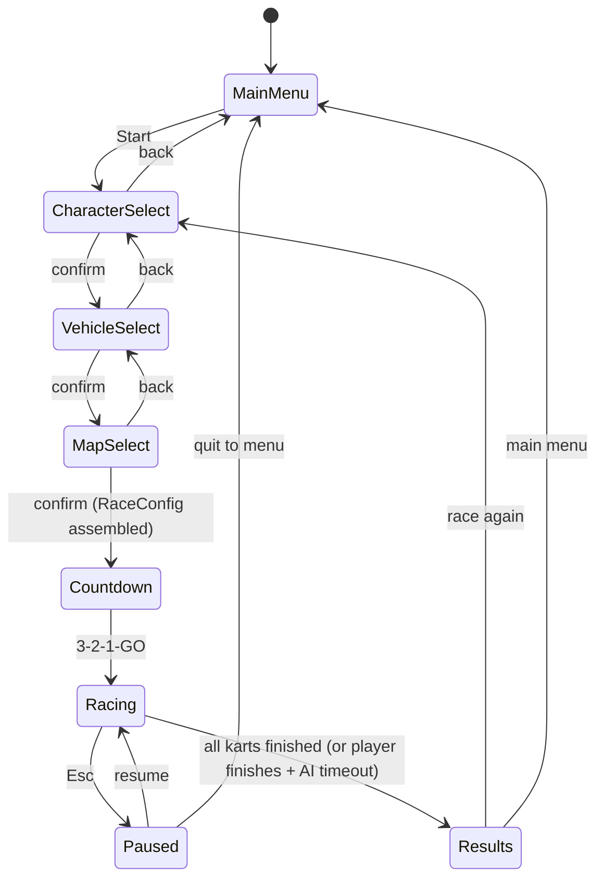

# Turbo Turtle Rally — Architecture

> **Phase 0 reference document.** Defines the code layout, key interfaces, SOLID mapping, event catalog, state machine, determinism rules and coding conventions. Phase docs (`02`–`09`) must not contradict this file; if a phase needs to change architecture, update this doc in the same commit.

## 1. Core Principle: Logic is Decoupled from Rendering

**All game logic modules are plain TypeScript with zero Babylon imports.** They operate on plain data (`KartState`, `Vec3`-like `{x,y,z}` records) and pure functions. Rendering lives in a separate layer that (a) subscribes to the typed event bus for discrete events (item used, lap completed, race finished) and (b) reads entity state each frame to update meshes/camera/HUD.

Consequences:
- Unit tests run headlessly in Node — no WebGL, no browser.
- A **headless race simulation** (entities + physics + AI, no scene) is the backbone of integration tests.
- Babylon version upgrades cannot break game rules; only renderers need touching.

```
┌─────────────── INPUT ───────────────┐      ┌──────────────── LOGIC (pure TS) ────────────────┐
│ IInputSource ← KeyboardInput        │      │ RaceController                                  │
│                                     │      │  ├─ KartEntity[] + KartPhysics.step()           │
└─────────────────────────────────────┘      │  ├─ IAiStrategy (WaypointAiStrategy)            │
                                             │  ├─ LapTracker / StandingsCalculator            │
┌─────────────── RENDER ─────────────────┐   │  ├─ ItemBoxSpawner + IItemEffect impls          │
│ KartRenderer, TrackBuilder, Camera     │◄──┤  └─ ShellProjectile.step()                      │
│ Hud (DOM), ParticleFactory, ScreenShake│    └─────────────────────────────────────────────────┘
│ MusicSequencer, SfxPlayer              │            ▲ dispatches via EventBus
└────────────────────────────────────────┘────────────┘
```

## 2. Folder Layout

```
src/
  main.ts                  # bootstrap: WebGL2 check, engine, scene, GameApp wiring; exposes window.__game
  core/
    GameApp.ts             # owns FixedTimestepLoop; dispatches update(dt) to the active state handler
    GameStateMachine.ts    # typed states + transition table (SRP: transitions only)
    EventBus.ts            # typed pub/sub, one channel per event name
    FixedTimestepLoop.ts   # accumulator loop, deterministic dt = 1/60 s        [EXISTS — Phase 0]
    RaceConfig.ts          # immutable { characterId, vehicleId, mapId } assembled by selection screens
  input/
    IInputSource.ts        # interface: axis(), button(), justPressed()         (DIP)
    KeyboardInput.ts       # WASD/arrows + Space(drift) + E(item) + Esc(pause)
  data/                    # pure data + validation, no Babylon imports
    characters.ts          # CHARACTER_ROSTER: CharacterDef[]
    vehicles.ts            # VEHICLE_ROSTER: VehicleDef[]
    items.ts               # ITEM_DEFS + position-based spawn tables (pure data)
    tuning.ts              # ALL gameplay magic numbers (see §6 Tuning)
    tracks/
      greenhollow-meadows.ts # TrackDefinition for `meadows`
      lava-lagoon-loop.ts  # TrackDefinition for `lagoon`
  entities/
    KartEntity.ts          # mutable state: pos, heading, speed, lap, checkpointIdx, item, status effects
    KartPhysics.ts         # pure fn step(state, input, surface, dt) -> new state (SRP/OCP)
    DriftController.ts     # drift charge state machine (pure): none→charging1→charging2→release boost
    PlayerController.ts    # maps IInputSource → DriveInput for the player kart
    IAiStrategy.ts         # interface: decide(kart, raceView, dt) -> DriveInput   (DIP/OCP)
    WaypointAiStrategy.ts  # follow spline waypoints + rubber-band speed target
    KartRenderer.ts        # builds/updates Babylon mesh from KartEntity state (SRP: visuals only)
  tracks/
    TrackSpline.ts         # Catmull-Rom sampling, arc-length table, closestPoint(), pointAt(t), tangentAt(t)
    TrackBuilder.ts        # road ribbon mesh, barriers, ground, item-box anchors; placeAlongSpline() for props
    LapTracker.ts          # checkpoint sequence → lap count (pure, unit-tested)
  items/
    IItemEffect.ts         # interface: apply(ctx: RaceContext): EffectResult[]   (OCP — new item = new class)
    ItemEffects.ts         # ZoomShroom, GreenPeaShell, RedChiliShell, BlueStormShell,
                           # SlickBanana, SparkleStar, ZapLightning, BulletBill
    ShellProjectile.ts     # projectile state + pure step() (bounces/homing/targeting per shell kind)
    ItemBoxSpawner.ts      # position-based item table rules; box respawn timers
  race/
    RaceController.ts      # countdown → racing → finished; owns entities, lap tracking, standings
    StandingsCalculator.ts # pure: rank by (lap, checkpointIdx, splineProgress)
  rendering/
    RenderPipelineSetup.ts # procedural gradient skybox, per-map lighting rig + fog, bloom + SSAO + color grading
    QualityManager.ts      # Low/Medium/High presets (shadow res, SSAO on/off, particle budget, pixelRatio)
                           # + GPU auto-detect; applied live from settings
  ui/
    MenuScreen.ts          # title + Start / Quit
    CharacterSelect.ts     # roster grid + stat bars
    VehicleSelect.ts       # vehicle cards + combined stats preview
    MapSelect.ts           # map preview cards (palette swatches + name)
    ResultsScreen.ts       # final standings, lap times, podium animation hook
    PauseMenu.ts           # Esc: resume / settings / quit to menu
    SettingsPanel.ts       # quality preset, master/music/SFX volume, mute; persisted via SettingsStore
    Hud.ts                 # DOM overlay: speedometer (animated needle), item slot w/ canvas-drawn icons,
                           # lap counter + current/best lap times, position, minimap canvas
    SettingsStore.ts       # tiny localStorage-backed settings persistence (unit-tested)
  audio/
    AudioManager.ts        # master bus, per-bus volumes, mute; unlock-on-first-interaction   (SRP)
    MusicSequencer.ts      # step-sequenced WebAudio chiptune loops: menu + 2 race themes
    SfxPlayer.ts           # one-shot synthesized SFX: boost, hit, star, pickup, countdown beeps, fanfare;
                           # speed-reactive engine loop (pitch/volume from KartState.speedRatio)
  vfx/
    ParticleFactory.ts     # boost flames (charge-tier colors), shell explosion, star sparkle, lightning flash, confetti
    ScreenShake.ts         # camera shake envelope (amplitude decay); triggered by impacts/boosts
tests/
  unit/**                  # Vitest — pure logic only
  e2e/**                   # Playwright — browser flow tests
docs/plans/                # this multi-document plan
```

## 3. SOLID Mapping

| Principle | Where it shows up |
|---|---|
| **S** (Single Responsibility) | Each file has one job: `KartPhysics` never touches meshes; `Hud` never mutates race state; `MusicSequencer` knows nothing about items; `QualityManager` only maps preset → engine/render settings. |
| **O** (Open/Closed) | New item = implement `IItemEffect` + register in the factory map — no edits to spawner or race code. New AI behavior = implement `IAiStrategy`. New track = add a data file, zero system changes. New quality preset = extend the preset table. |
| **L** (Liskov) | Any `IAiStrategy` is substitutable in `RaceController`; any `IInputSource` works with `PlayerController` (keyboard today, fake input in tests). |
| **I** (Interface Segregation) | Small interfaces: `IInputSource`, `IItemEffect`, `IAiStrategy`. Effects receive a narrow `RaceContext` view — not the whole game. No god-interfaces. |
| **D** (Dependency Inversion) | Controllers depend on abstractions injected via constructors (`PlayerController(input: IInputSource)`, `RaceController(aiFactory: (def) => IAiStrategy)`). Enables headless simulation with fake inputs and scripted AI. |

## 4. Key Interface Signatures

> All logic types use plain records, **not** Babylon `Vector3`:
> ```ts
> interface Vec2 { readonly x: number; readonly z: number }
> interface Vec3 { readonly x: number; readonly y: number; readonly z: number }
> ```
> Renderers convert to Babylon vectors at the boundary.

```ts
// ── entities/KartPhysics.ts (pure) ────────────────────────────────
type SurfaceKind = "road" | "offRoad" | "oilSlick";

interface DriveInput {
  readonly throttle: number;   // -1..1  (negative = brake/reverse)
  readonly steer: number;      // -1..1
  readonly drifting: boolean;  // Space held while turning
  readonly useItem: boolean;   // edge-triggered, consumed by RaceController
}

interface KartState {
  pos: Vec3; heading: number; speed: number;        // meters, radians, m/s (signed)
  lap: number; checkpointIdx: number;               // 0-based
  item: ItemId | null;
  statusEffects: StatusEffect[];                     // e.g. { kind:"star", remaining }
  driftCharge: DriftChargeState;                    // see DriftController
  speedRatio: number;                               // 0..1 normalized top speed (audio/camera)
}

/** Advances one fixed step. Pure: returns a new state, mutates nothing. */
function stepKart(state: KartState, input: DriveInput, surface: SurfaceKind, dt: number): KartState;

// ── entities/DriftController.ts (pure) ────────────────────────────
type DriftChargeState = "none" | "charging1" | "charging2";
function updateDrift(state: DriftChargeState, input: DriveInput, dt: number): { charge: DriftChargeState; releasedBoost?: BoostTier };
type BoostTier = "mini" | "super";

// ── tracks/TrackSpline.ts (pure) ──────────────────────────────────
class TrackSpline {
  constructor(controlPoints: Vec2[], samplesPerSegment: number);
  readonly length: number;                       // total arc length, meters
  pointAt(t: number): Vec3;                      // t in 0..1 along loop
  tangentAt(t: number): Vec2;                    // unit tangent (for facing/props)
  closestPoint(p: Vec2): { t: number; distance: number; onRoad: boolean };
}

// ── tracks/LapTracker.ts (pure) ───────────────────────────────────
interface LapState { lap: number; lastCheckpointIdx: number }
function onCheckpoint(state: LapState, checkpointIdx: number, totalCheckpoints: number):
  { state: LapState; lapCompleted?: boolean; raceFinished?: boolean };

// ── items/IItemEffect.ts (OCP extension point) ────────────────────
interface RaceContext {
  readonly owner: KartEntity;
  readonly allKarts: ReadonlyArray<KartEntity>;   // includes owner, sorted by standings
  readonly spawnProjectile: (p: ShellProjectileInit | BulletBillInit) => void;
  readonly placeBanana: (pos: Vec3) => void;
}
interface EffectResult { readonly kind: string; readonly targetId?: string }
interface IItemEffect { apply(ctx: RaceContext): EffectResult[] }

// ── items/ShellProjectile.ts (pure step) ──────────────────────────
type ShellKind = "green" | "red" | "blue";
function stepShell(shell: ShellState, karts: ReadonlyArray<KartEntity>, spline: TrackSpline, dt: number):
  { shell: ShellState; hit?: KartId };

// ── entities/IAiStrategy.ts (DIP) ─────────────────────────────────
interface RaceView { readonly standings: ReadonlyArray<{ id: KartId; lap: number; progress: number }> }
interface IAiStrategy { decide(kart: KartEntity, view: RaceView, dt: number): DriveInput }

// ── input/IInputSource.ts (DIP) ───────────────────────────────────
interface IInputSource {
  axis(name: "throttle" | "steer"): number;      // -1..1
  button(name: "drift" | "item" | "pause"): boolean;
  justPressed(name: "item" | "pause"): boolean;  // edge-triggered, cleared each logic step
}

// ── race/StandingsCalculator.ts (pure) ────────────────────────────
function computeStandings(karts: ReadonlyArray<KartEntity>, spline: TrackSpline): Array<{ id: KartId; rank: number }>;
```

## 5. Event Bus Catalog

`EventBus<T extends GameEvents>` — typed channels, one `on/off/emit` per event name. Discrete events only (continuous state is read directly each frame).

| Event | Payload | Emitted by | Consumed by |
|---|---|---|---|
| `race:countdownTick` | `{ remaining: 3\|2\|1 }` | RaceController | Hud, SfxPlayer (beeps) |
| `race:start` | `{}` | RaceController | MusicSequencer (menu→race theme), Hud |
| `race:lapCompleted` | `{ kartId, lap, timeMs }` | RaceController | Hud (best-lap flash), SfxPlayer |
| `race:finished` | `{ standings, times }` | RaceController | GameApp → ResultsScreen, MusicSequencer (fanfare) |
| `item:pickedUp` | `{ kartId, item }` | ItemBoxSpawner | Hud (slot icon), SfxPlayer, ParticleFactory |
| `item:used` | `{ kartId, item }` | RaceController | SfxPlayer, ParticleFactory, ScreenShake |
| `kart:hit` | `{ kartId, byKartId?, shellKind? }` | ShellProjectile/RaceController | SfxPlayer, ScreenShake, KartRenderer (flash) |
| `kart:boosted` | `{ kartId, tier: "mini"\|"super"\|"shroom" }` | DriftController/KartPhysics | ParticleFactory (flames), SfxPlayer, ScreenShake |
| `kart:skid` | `{ kartId, cause: "banana"\|"oilSlick" }` | RaceController | KartRenderer (spin anim), SfxPlayer |
| `ui:navigate` | `{ to: GameScreen }` | UI screens | GameStateMachine |

## 6. Tuning (`src/data/tuning.ts`)

**Every gameplay magic number lives here** — physics constants, drift charge times, boost magnitudes/durations, item durations, AI rubber-band factors, quality preset values. No other file may contain a raw gameplay constant. This makes Phase 7 balancing a single-file exercise and keeps unit tests stable (tests import the same table).

```ts
export const TUNING = {
  physics: { maxSpeedBase: 30, accelBase: 12, brakeForce: 25, reverseMax: -8, steerRateBase: 2.4, offRoadDrag: 0.92 },
  drift:   { charge1Time: 0.6, charge2Time: 1.4, miniBoostSpeed: 38, superBoostSpeed: 46, boostDuration: 0.8 },
  items:   { shroomBoost: 40, starDuration: 6, lightningShrink: 5, bananaSkid: 1.0, shellBounceMax: 3 },
  ai:      { rubberBandFactor: 0.06, speedVariance: 0.08, waypointLookahead: 12 },
  quality: { /* per-preset shadow res, ssao on/off, particle budget multiplier, pixelRatio */ },
} as const;
```

## 7. Coding Conventions

- **TypeScript strict**; `no-explicit-any` is an ESLint error. Prefer `import type { X }` for types-only imports.
- **Relative imports use the `.js` extension** (ESM + Vite convention), e.g. `import { stepKart } from "./KartPhysics.js"`.
- **Pure logic files must not import from `@babylonjs/core`** — enforced by code review and a unit test that greps `src/**` for Babylon imports outside allowed folders (`scene/`, `rendering/`, `vfx/`, `ui/Hud.ts` minimap, `main.ts`).
- **Naming:** PascalCase classes/types, camelCase functions/vars, UPPER_SNAKE for constants in `tuning.ts`. Files named after their primary export.
- **Errors:** logic modules throw `Error` with descriptive messages; UI catches at the boundary and shows a toast. No silent `catch {}`.
- **Immutability:** pure step functions return new state objects; entities are mutable only inside `RaceController.update(dt)`.
- **Determinism:** all randomness goes through an injectable seeded RNG (`createRng(seed)` in `core/`), never `Math.random()` directly — headless tests must be reproducible.
- **Time:** logic always receives the fixed `dt = 1/60`; renderers may interpolate with alpha but never advance logic.

## 8. State Machine (Game Screens)



`GameStateMachine` holds only the current state id and a transition table; each screen is an object implementing `IGameScreen { enter(ctx), exit(), update(dt)?, render?() }`. The machine never contains screen logic (SRP).

## 9. Determinism & Testability Rules

1. **Fixed timestep** — all logic runs at exactly 1/60 s via `FixedTimestepLoop` (already implemented in Phase 0).
2. **Seeded RNG** — race seed = f(characterId, vehicleId, mapId) so a given setup is reproducible; tests pass explicit seeds.
3. **Headless simulation** — `RaceController` can be constructed with no renderer: entities + physics + AI only. The Phase 4 unit test runs a full 3-lap race headlessly and asserts it finishes in a sane time window with a valid standings order.
4. **E2E handle** — `window.__game` exposes `{ state, standings(), karts() }` snapshots for Playwright assertions (per environment practice: verify via DOM + `page.evaluate`, never screenshots).
5. **Fake inputs** — tests inject an `IInputSource` implementation that scripts key sequences; the same code path runs as in-game keyboard input.

## 10. Quality Presets (contract defined here, implemented Phase 3)

| Setting | Low | Medium | High |
|---|---|---|---|
| Shadow map | off | 1024 | 2048 |
| SSAO | off | on (half res) | on |
| Bloom / color grade | off | on | on |
| Particle budget multiplier | 0.35 | 0.7 | 1.0 |
| Pixel ratio | min(device, 1) | min(device, 1.5) | device |
| Prop density (per map catalog) | 40% | 70% | 100% |

Auto-detect: measure a short burst of rendered frames at High on first launch; if average FPS < 50, step down one preset. Persisted choice overrides auto-detect (`SettingsStore`). All VFX/particle code queries `QualityManager.budget()` — never hardcodes counts (this is what makes presets cheap to add).
